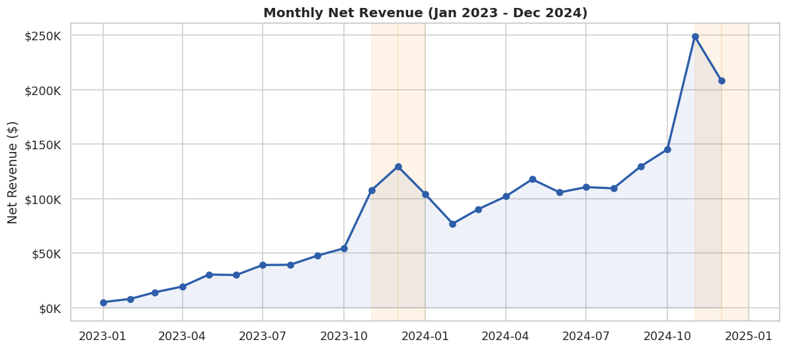
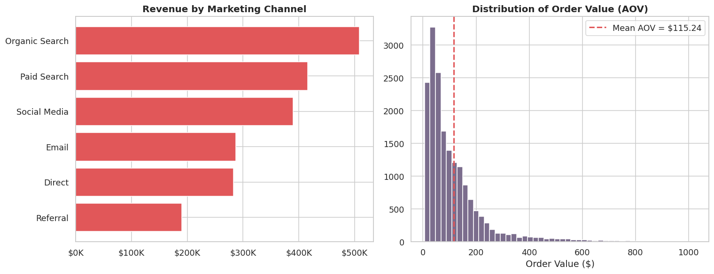
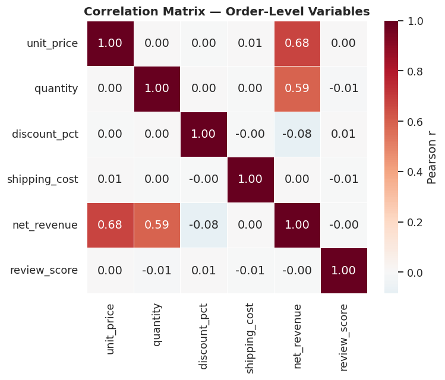
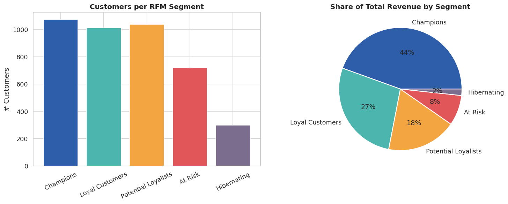
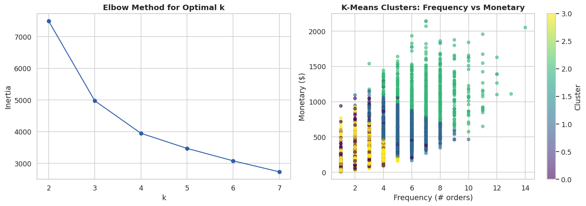
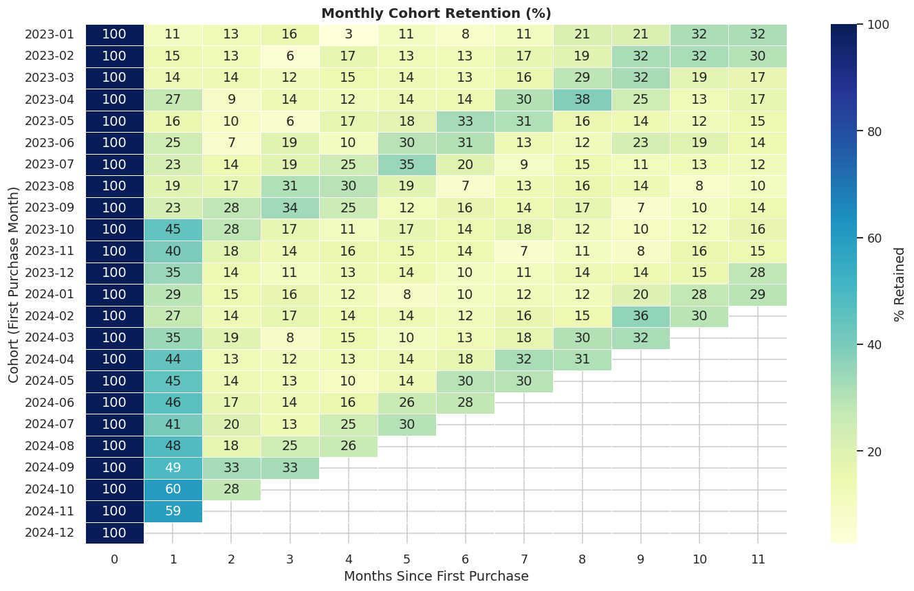
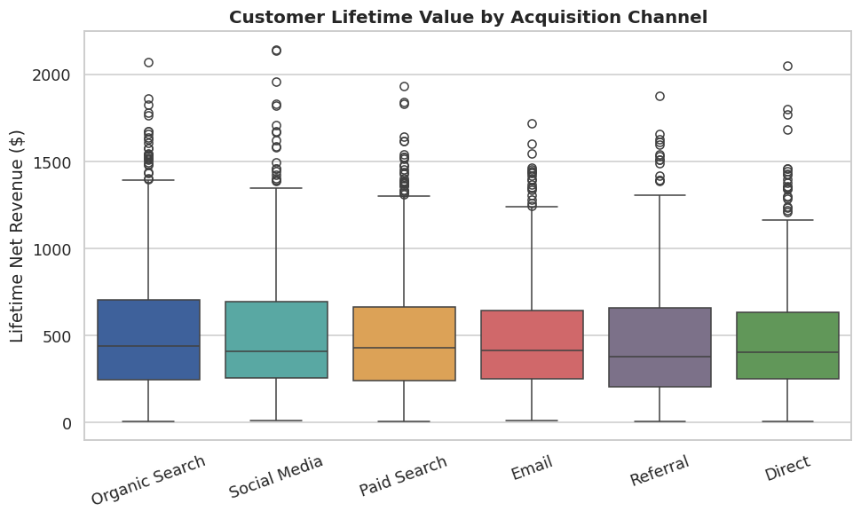
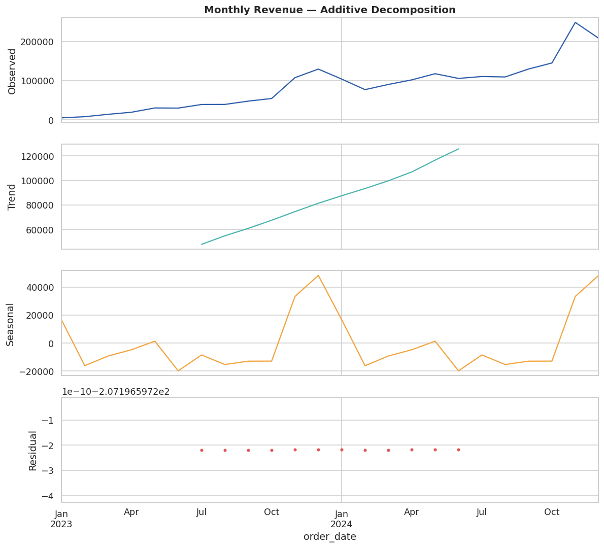

# E-Commerce Sales Performance & Customer Analytics

*End-to-end data analysis project: cleaning a messy transactional export, exploratory analysis, statistical hypothesis testing, RFM customer segmentation, cohort retention, and dashboard-ready data exports.*


---

## 📌 Project Overview

An online retailer wants to know: **what's driving revenue, which customers
matter most, and where's the biggest opportunity for growth?**

This project simulates the full workflow of a data analyst answering that
question — starting from a raw, imperfect transactional export (18,216 rows,
Jan 2023–Dec 2024) and ending with a cleaned dataset, statistically-grounded
insights, and dashboard-ready exports for BI tools.

**The dataset is synthetically generated** (`src/generate_data.py`) but built
to mimic a real e-commerce export: realistic seasonality, customer behavior,
and — deliberately — the kinds of data quality problems analysts deal with
every day (duplicates, missing values, inconsistent text formatting, mixed
date formats, and data-entry errors).

## 🎯 Business Questions Answered

1. How does revenue trend over time, and is it seasonal?
2. Which product categories, regions, and marketing channels drive the most revenue?
3. Do discounts actually increase how much customers buy?
4. Does return rate vary meaningfully by product category?
5. Which customers are most valuable, and how should they be segmented?
6. How well does the business retain customers after their first purchase?
7. Which acquisition channels produce the highest lifetime value customers?

## 🗂️ Repository Structure

```
ecommerce-sales-analytics/
├── README.md
├── requirements.txt
├── data/
│   ├── raw/
│   │   └── ecommerce_raw.csv          # Raw, messy export (as generated)
│   └── processed/
│       └── ecommerce_clean.csv        # Cleaned, analysis-ready dataset
├── notebooks/
│   └── ecommerce_analysis.ipynb       # Full analysis, executed with outputs
├── exports/                           # Flat files ready for Tableau / Power BI
│   ├── orders_dashboard_ready.csv
│   ├── monthly_summary.csv
│   └── customer_rfm_clv.csv
├── images/                            # Chart exports referenced below
└── src/
    └── generate_data.py               # Reproducible synthetic data generator
```

## 🛠️ Tech Stack

| Purpose | Tools |
|---|---|
| Data manipulation | `pandas`, `numpy` |
| Statistical testing | `scipy.stats` |
| Time series decomposition | `statsmodels` |
| Clustering (segmentation validation) | `scikit-learn` (K-Means) |
| Visualization | `matplotlib`, `seaborn` |
| Dashboarding (BI-ready exports) | Tableau / Power BI *(flat CSV exports included)* |

## 🧹 Data Cleaning

The raw export contains realistic problems, all resolved with documented,
defensible rules (see notebook §2):

| Issue | Rows Affected | Resolution |
|---|---|---|
| Duplicate `order_id`s | 216 | Dropped, keeping first occurrence |
| Mixed date formats (`YYYY-MM-DD` / `DD/MM/YYYY`) | ~5% | Parsed with format inference, verified zero nulls after |
| Inconsistent category text casing/whitespace | ~3% | Standardized via `.strip().str.title()` |
| Negative `unit_price` (data-entry errors) | 15 | Corrected via absolute value; dependent fields recomputed |
| Missing `shipping_cost` | ~3,300 | Imputed with region-level median |
| Missing `review_score` | ~6,300 | Left as `NaN` + flagged with `has_review` (not every order gets reviewed — imputing would fabricate signal) |
| Blank `region` | 9 | Recoded to `"Unknown"` |
| Missing `customer_segment` | ~360 | Recoded to `"Unknown"` (kept visible, not dropped) |

**Result:** 18,000 clean, deduplicated order records ready for analysis.

## 📊 Key Findings

### 1. Revenue & Seasonality
Total net revenue across the two-year window: **$2.07M** across **18,000
orders** from **4,134 unique customers**. Revenue grew **~195% year-over-year**
(2023 → 2024), with sharp, consistent spikes in **November–December**
(holiday shopping) at roughly 2.4x the baseline monthly rate.



### 2. Category & Region Performance
**Office Supplies** ($504K) and **Electronics** ($448K) are the top two
revenue-generating categories — together over 45% of total revenue —
followed by Home & Kitchen and Sports & Outdoors.


### 3. Channel Performance & Order Value
Average order value (AOV) is **$115.24** (95% CI: **$113.44 – $117.04**).



### 4. Statistical Tests

| Test | Question | Result | Conclusion |
|---|---|---|---|
| Welch's t-test | Do discounts increase units per order? | p = 0.136 | **No significant effect** — discounts don't move basket size here; evaluate discount ROI on conversion, not order size |
| One-way ANOVA | Does revenue differ by category? | p < 0.001 | **Yes**, significant differences exist across the 7 categories |
| Chi-square test | Is return rate independent of category? | p < 0.001 | **No** — return rate is category-dependent; Apparel has the highest return rate at **8.3%**, roughly double most other categories |



### 5. Customer Segmentation (RFM)
Customers were scored on **R**ecency, **F**requency, and **M**onetary value
and grouped into five segments. Segments were cross-validated with an
unsupervised K-Means clustering, which recovered broadly the same groupings.

| Segment | # Customers | % of Base | % of Revenue |
|---|---|---|---|
| Champions | 1,073 | 26.0% | **44.5%** |
| Loyal Customers | 1,010 | 24.4% | 27.5% |
| Potential Loyalists | 1,036 | 25.1% | 18.4% |
| At Risk | 717 | 17.3% | 8.0% |
| Hibernating | 298 | 7.2% | 1.7% |

**A quarter of customers ("Champions") generate nearly half of all revenue** —
a classic concentration pattern that should directly inform retention and
loyalty investment.




### 6. Cohort Retention
Monthly cohort analysis shows the typical steep early drop-off, with
retention stabilizing at a long tail after month 2–3 — a signal that
early-lifecycle engagement (first 30–60 days) is the highest-leverage window
for retention efforts.



### 7. Customer Lifetime Value by Channel
Lifetime value varies meaningfully by acquisition channel, information that
should factor into acquisition budget allocation alongside CPA.



### 8. Time Series Decomposition
Decomposing revenue confirms a consistent upward trend independent of the
strong seasonal component identified earlier.



## 💡 Recommendations

| # | Finding | Recommendation |
|---|---|---|
| 1 | Revenue peaks ~2.4x baseline in Nov–Dec | Shift inventory and paid media budget earlier (October) to capture the ramp-up, not just the peak |
| 2 | Discounts don't significantly change order size (p = 0.136) | Reframe discount strategy around new-customer conversion rather than basket-size growth |
| 3 | Office Supplies & Electronics drive ~46% of revenue | Prioritize merchandising and marketing spend toward top categories |
| 4 | Apparel has the highest return rate (8.3%) | Investigate sizing/fit content and return-reason data specifically for Apparel |
| 5 | Champions (26% of customers) drive 44.5% of revenue | Build a loyalty/VIP program to protect this concentrated, high-value segment |
| 6 | Retention drops sharply after month 0–1 | Launch a lifecycle email campaign targeting the 30–60 day post-purchase window |
| 7 | CLV differs by acquisition channel | Reweight acquisition spend toward channels with higher median CLV, not just lowest CPA |

## 📈 Dashboard-Ready Exports

The `/exports` folder contains flat, denormalized CSVs designed to be
connected directly to **Tableau Desktop/Public** or **Power BI Desktop** for
an interactive dashboard layer on top of this analysis:

- **`orders_dashboard_ready.csv`** — full order-level fact table joined with customer RFM segment and cluster
- **`monthly_summary.csv`** — pre-aggregated monthly KPIs (revenue, orders, AOV, units)
- **`customer_rfm_clv.csv`** — one row per customer with RFM scores, segment, and acquisition channel

## 🚀 Reproducing This Project

```bash
# 1. Clone the repo
git clone https://github.com/lucadelucia/ecommerce-sales-analytics.git
cd ecommerce-sales-analytics

# 2. Install dependencies
pip install -r requirements.txt

# 3. (Optional) Regenerate the raw synthetic dataset
python src/generate_data.py

# 4. Run the analysis notebook
jupyter notebook notebooks/ecommerce_analysis.ipynb
```

## 🔭 Future Improvements

- Build an interactive Tableau/Power BI dashboard from the exported CSVs and link it here
- Add a predictive model (e.g. churn prediction, next-purchase propensity) on top of the RFM features
- Incorporate marketing spend by channel to compute true channel-level ROI/CAC, not just CLV
- Expand cohort analysis to include revenue-based (not just count-based) retention

## 📄 License

This project is released under the [MIT License](LICENSE). The dataset is
synthetically generated and contains no real customer data.

---

*Part of my data analytics portfolio. Feel free to reach out with questions or feedback.*
